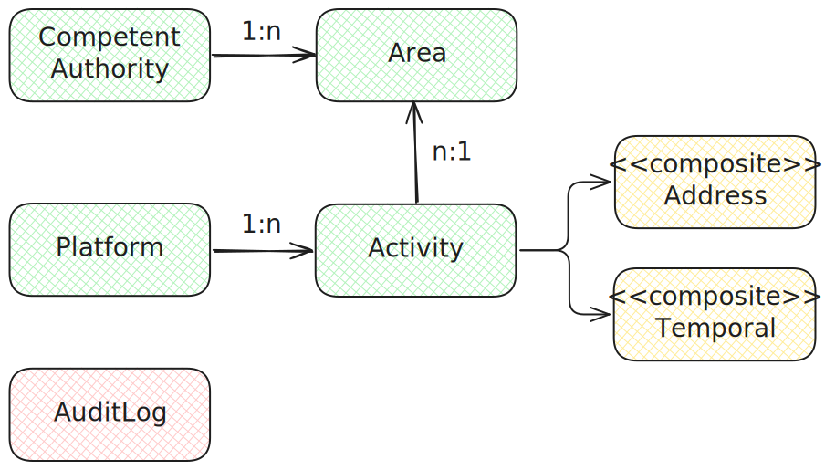

<h1>Internal Data Model</h1>

This page explains the SDEP **internal data model** (implementation).

**API clients** should ONLY look at the **external data model** (OpenAPI). \
https://sdep.gov.nl/api/v0/docs

<h2>Table of Contents</h2>

- [Data model](#data-model)
  - [Competent Authority](#competent-authority)
  - [Platform](#platform)
  - [Area](#area)
  - [Activity](#activity)
  - [Address (Composite)](#address-composite)
  - [Temporal (Composite)](#temporal-composite)
  - [AuditLog](#auditlog)
- [Key Patterns](#key-patterns)
  - [OLTP](#oltp)
  - [ID Management](#id-management)
  - [Versioning](#versioning)
  - [Soft-Delete](#soft-delete)
  - [Lazy load](#lazy-load)

## Data model

Overview:

- A **CompetentAuthority** regulates geographical **Areas** (typically one)
- A **Platform** submits rental **Activities** (subject to regulation)
- An **Activity** is regulated in an **Area**
- An **Activity** is located on an **Address** (rental location)
- An **Activity** happens during a **Temporal** (rental time period)
- Activities are routed to CompetentAuthorities based on the referenced Area

Diagram:



### Competent Authority

**Purpose:** Regulates short-term rental in geographic areas

| Attribute                  | Type      | Constraints                                                                                             |
| :------------------------- | :-------- | :------------------------------------------------------------------------------------------------------ |
| **id**                     | int       | is technical id, mandatory                                                                              |
| **competentAuthorityId**   | string    | is functional id, mandatory, length <= 64, alphanumeric with hypens, is auto-provisioned from JWT claim |
| **competentAuthorityName** | string    | optional, length <= 64, e.g. "Gemeente Amsterdam"                                                       |
| **createdAt**              | datetime  | mandatory, UTC                                                                                          |
| **endedAt**                | datetime  | optional, UTC                                                                                           |
| **areas**                  | reference | optional, references Area                                                                               |

**Class Constraints:**

- UNIQUE (competentAuthorityId, createdAt)

---

### Platform

**Purpose:** Delivers rental activities to competent authorities

| Attribute        | Type      | Constraints                                                                                             |
| :--------------- | :-------- | :------------------------------------------------------------------------------------------------------ |
| **id**           | int       | is technical id, mandatory                                                                              |
| **platformId**   | string    | is functional id, mandatory, length <= 64, alphanumeric with hypens, is auto-provisioned from JWT claim |
| **platformName** | string    | optional, length <= 64, e.g. "Example platform"                                                         |
| **createdAt**    | datetime  | mandatory, UTC                                                                                          |
| **endedAt**      | datetime  | optional, UTC                                                                                           |
| **activities**   | reference | optional, references many Activity                                                                      |

**Class Constraints:**

- UNIQUE (platformId, createdAt)

---

### Area

**Purpose:** Defines a geographic region for short-term rental regulation

| Attribute              | Type        | Constraints                                                                                                                         |
| :--------------------- | :---------- | :---------------------------------------------------------------------------------------------------------------------------------- |
| **id**                 | int         | is technical id, mandatory                                                                                                          |
| **areaId**             | string      | is functional id, mandatory, length <= 64, lowercase alphanumeric, is supplied or auto-provisioned otherwise (RFC 9562/4122 UUIDv4) |
| **areaName**           | string      | optional, length <= 64, e.g. "Amsterdam-Noord"                                                                                      |
| **createdAt**          | datetime    | mandatory, UTC                                                                                                                      |
| **endedAt**            | datetime    | optional, UTC                                                                                                                       |
| **competentAuthority** | reference   | mandatory, references single Competent Authority                                                                                    |
| **filename**           | string      | mandatory, length <= 64, e.g. "Amsterdam.zip"                                                                                       |
| **filedata**           | largeBinary | mandatory, max size 1MiB, e.g. a .zip with a collection of ESRI shapefile files                                                     |
| **activities**         | reference   | optional, references many Activity                                                                                                  |

**Class Constraints:**

- UNIQUE (areaId, competentAuthority, createdAt)

**Notes:**
- The same `areaId` (business identifier, optional) can be resubmitted to create new versions with different timestamps
- The UNIQUE class constraint allows the same `areaId` to be used (owned) by multiple competent authorities

---

### Activity

**Purpose:** Represents an actual rental activity submitted by a platform

| Attribute              | Type            | Constraints                                                                                                                           |
| :--------------------- | :-------------- | :------------------------------------------------------------------------------------------------------------------------------------ |
| **id**                 | int             | is technical id, mandatory                                                                                                            |
| **activityId**         | string          | is functional id, mandatory, length <= 64, alphanumeric with hypens, is supplied or auto-provisioned otherwise (RFC 9562/4122 UUIDv4) |
| **activityName**       | string          | optional, length <= 64, e.g. "Summer rental"                                                                                          |
| **createdAt**          | datetime        | mandatory, UTC                                                                                                                        |
| **endedAt**            | datetime        | optional, UTC                                                                                                                         |
| **platform**           | reference       | mandatory, references single Platform                                                                                                 |
| **area**               | reference       | mandatory, references single Area                                                                                                     |
| **url**                | string          | mandatory, length <= 128, e.g. http://example.com/my-advertisement                                                                    |
| **address**            | reference       | mandatory, references single Address composite                                                                                        |
| **registrationNumber** | string          | mandatory, length <= 32                                                                                                               |
| **numberOfGuests**     | int             | optional, min 1, max 1024                                                                                                             |
| **countryOfGuests**    | array of string | optional, min 1, max 1024, each ISO 3166-1 alpha-3                                                                                    |
| **temporal**           | reference       | mandatory, references single Temporal composite                                                                                       |

**Class Constraints:**

- UNIQUE (activityId, platform, createdAt)

**Notes:**
- The same `activityId` (business identifier, optional) can be resubmitted to create new versions with different timestamps
- The UNIQUE class constraint allows the same `activityId` to be used (owned) by multiple platforms
- Each activity must reference an existing area

---

### Address (Composite)

**Purpose:** Structured address information for rental activities (INSPIRE/STR-AP format)

| Attribute                     | Type   | Constraints                                                   |
| :---------------------------- | :----- | :------------------------------------------------------------ |
| **thoroughfare**              | string | mandatory, length <= 80, e.g. Turfmarkt                       |
| **locatorDesignatorNumber**   | int    | mandatory, >= 1, e.g. 147                                     |
| **locatorDesignatorLetter**   | string | optional, length <= 10, alphabetic, e.g. "a", "bis"           |
| **locatorDesignatorAddition** | string | optional, length <= 128, e.g. "5h"                            |
| **postCode**                  | string | mandatory, length <= 10, no spaces, alphanumeric, e.g. 2500EA |
| **postName**                  | string | mandatory, length <= 80, e.g. Den Haag                        |

---

### Temporal (Composite)

**Purpose:** Time period information for rental activities

| Attribute         | Type     | Constraints                     |
| :---------------- | :------- | :------------------------------ |
| **startDatetime** | datetime | mandatory, year must be >= 2025 |
| **endDatetime**   | datetime | mandatory                       |

**Class Constraints:**

- CHECK (startDatetime < endDatetime)

### AuditLog

**Purpose:** Append-only log of API requests for compliance, security monitoring, and operational accountability

| Attribute          | Type     | Constraints                                       |
| :----------------- | :------- | :------------------------------------------------ |
| **id**             | int      | is technical id, mandatory                        |
| **timestamp**      | datetime | mandatory, UTC, server default now()              |
| **requestId**      | string   | mandatory, UUID4, length <= 64                    |
| **roles**          | string   | nullable, length <= 256, comma-separated from JWT |
| **resourceType**   | string   | nullable, length <= 32                            |
| **action**         | string   | mandatory, length <= 64, semantic action name     |
| **httpMethod**     | string   | mandatory, length <= 10                           |
| **path**           | string   | mandatory, length <= 512                          |
| **httpStatusCode** | int      | mandatory                                         |
| **statusCode**     | string   | mandatory, length <= 3, "OK" if < 400 else "NOK"  |
| **durationMs**     | int      | nullable                                          |

**Notes:**
- Append-only: no updates or deletes (except automated retention cleanup)
- Standalone table with no foreign key relationships
- Indexes on: `timestamp`, `request_id`
- **Retention:** rows older than `AUDITLOG_RETENTION` days (default 1) are automatically deleted by a background task

---

## Key Patterns

### OLTP
- Single POST (`POST /str/activities`) — default for all platforms
- Bulk POST (`POST /str/activities/bulk`) — for high-volume platforms (up to 1000 items/batch); see [API.md § Bulk endpoint](./API.md#bulk-endpoint) for design decisions
- Single concurrency (no optimistic locking)

### ID Management

Technical IDs
- Represent technical keys, on the **“inside”** (under the hood)
- These are used for referential integrity within the database

Functional IDs
- Represent business identifiers, on the **“outside”**
- Are client-provided (optional), or auto-provisioned otherwise (RFC 9562/4122 UUIDv4)
  - Exception: `platformId` and `competentAuthorityId` (these are auto-provisioned from JWT-claim)
- After a POST, functional IDs are always returned/made visible
- This allows them to be reused in subsequent submissions
- Functional IDs enable versioning (in combination with a timestamp)

https://datatracker.ietf.org/doc/rfc9562/

### Versioning
- Same functional ID can be resubmitted with new timestamp for versioning
  - Entities use `(functionalId, createdAt)` as unique constraint
- Stacking
  - Last becomes current (empty `endedAt`)
  - Previous becomes ended (`endedAt`)
- Enables historical tracking and updates without losing previous versions
- Standard retrieve only yields the current

### Soft-Delete
- When all versions of a functional ID have `endedAt` set, the entity is considered **deactivated**
- Creating a new version with a deactivated functional ID is rejected (HTTP 422)
- This prevents "resurrecting" soft-deleted entities
- The guard applies to: `competentAuthorityId`, `platformId`, `areaId`, and `activityId`

### Lazy load

- **Default lazy loading**
  - Relationships have no explicit `lazy=` parameter (uses SQLAlchemy defaults)
- **Custom eager loading** via `selectinload()` at query time
  - When relationships are needed, CRUD functions explicitly load them, e.g.:
    ```python
    stmt = select(Activity).options(
        selectinload(Activity.platform),
        selectinload(Activity.area).selectinload(Area.competent_authority),
    )
    ```
- **Benefits**
  - Eager-when-needed (loads relationships in bulk via `selectinload`)
  - Idiomatic (reduced boilerplate, less-verbose than manual queries)
