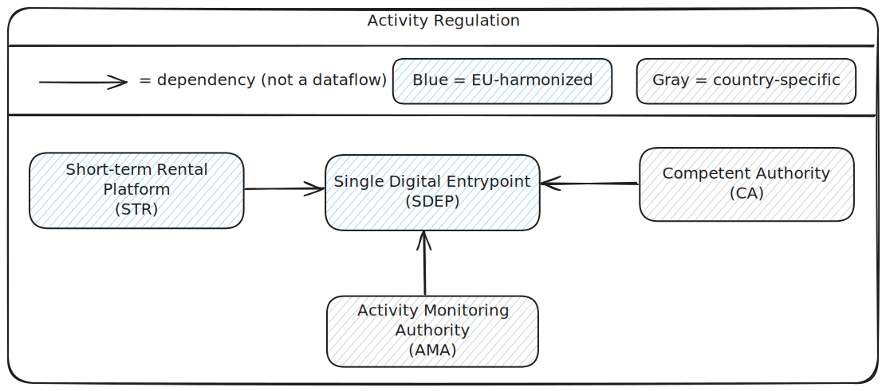

<h1>Listing and Activity</h1>

**Status: PROPOSAL - WORK IN PROGRESS**

Context: https://github.com/SEMICeu/sdep/issues/39 (random checks).

Although for random checks only **listings** apply, this document covers both **listings and activities**, to understand the whole regulation picture.

- [Definitions](#definitions)
  - [Property Host (Host)](#property-host-host)
  - [Short-Term Rental Platform (STR)](#short-term-rental-platform-str)
  - [Listing](#listing)
  - [Activity](#activity)
  - [Registration Registry (RR)](#registration-registry-rr)
  - [Address](#address)
  - [Area](#area)
  - [Regulated Area](#regulated-area)
  - [Competent Authority (CA)](#competent-authority-ca)
  - [Listing Regulation](#listing-regulation)
  - [Listing Monitoring](#listing-monitoring)
  - [Listing Monitoring Authority (LMA)](#listing-monitoring-authority-lma)
  - [Activity Regulation](#activity-regulation)
  - [Activity Monitoring](#activity-monitoring)
  - [Activity Monitoring Authority (AMA)](#activity-monitoring-authority-ama)
- [Listing Regulation](#listing-regulation-1)
  - [Register](#register)
  - [Self-declare](#self-declare)
  - [Report](#report)
  - [Inform](#inform)
  - [Enforce](#enforce)
  - [Monitor](#monitor)
- [Activity regulation](#activity-regulation-1)
  - [Report](#report-1)
  - [Enforce](#enforce-1)
  - [Monitor](#monitor-1)
- [Design notes](#design-notes)
  - [Asynchronous](#asynchronous)
  - [Adress](#adress)
  - [Area - CA - RR](#area-ca-rr)
  - [Unit](#unit)

---

## Definitions

*From a technical (implementation) perspective.*

### Property Host (Host)
An individual who offers a private property for short-term rental.

### Short-Term Rental Platform (STR)
An online platform that facilitates listings of private properties for short-term rental.

### Listing
A published rental offering on an **STR**.

### Activity
A completed or ongoing short-term rental transaction conducted via an **STR**.

### Registration Registry (RR)
An entity in which listing addresses are registered and assigned a unique registration number (**reg#**).

### Address
The physical location of a property, as used in the context of a listing or activity.

### Area
The geographical zone in which an address is located, within the context of a listing or activity.

### Regulated Area
An area subject to Regulation (EU) 2024/1028.
https://eur-lex.europa.eu/eli/reg/2024/1028/oj/eng

### Competent Authority (CA)
An authority responsible for enforcing regulations in designated regulated areas for short-term rentals.

### Listing Regulation
The process of regulating listings in accordance with Regulation (EU) 2024/1028.

### Listing Monitoring
The process of overseeing compliance with listing regulations.

### Listing Monitoring Authority (LMA)
An authority responsible for monitoring compliance with listing regulations.

### Activity Regulation
The process of regulating rental activities in accordance with Regulation (EU) 2024/1028.

### Activity Monitoring
The process of overseeing compliance with activity regulations.

### Activity Monitoring Authority (AMA)
An authority responsible for monitoring compliance with activity regulations.

---

## Listing Regulation

When a host has created a listing on the STR platform, and the listing’s address falls within a regulated area, then following regulatory actions apply:

| Actor    | Action                    | Detail                                                                                               |
| -------- | ------------------------- | ---------------------------------------------------------------------------------------------------- |
| **Host** | **Register in RR**        | Registrate the listing address and obtain a **reg#**                                                 |
| **Host** | **Self-declare on STR**   | "I have knowledge of the regulated area"                                                             |
| **STR**  | **Reportg (1/3) to SDEP** | Supply a random set of listing reg# (**random checks**)                                              |
| **RR**   | **Report (2/3) to SDEP**: | Evaluate and inform about RR reg# status and RR reg# address                                         |
| **STR**  | **Report (3/3) to SDEP**: | Flag the listing with STR reg# status (after evaluating RR reg# status and STR/RR address match) [1] |
| **STR**  | **Inform** the host       | When NOK                                                                                             |
| **CA**   | **Enforce** the host      | On regulation                                                                                        |
| **LMA**  | **Monitor** the process   | At least the #reported flagged listings                                                              |

[1] Can SDEP wipe the RR-info within this transaction?

**Actor dependencies** are illustrated in the following diagram:

**Actions** are described below.

### Register

If a listing address falls within a regulated area, the host must obtain a registration number (**reg#**) for the listing address in a registration registry (**RR**).

This process is outside the scope of **SDEP**.

### Self-declare

If a listing address falls within a regulated area, the host must enter on the **STR**:

- The acquired registration number (**reg#**)
- A self-declaration attesting to knowledge of the regulated area

This process is outside the scope of **SDEP**.

### Report

| Is STR listing in area | Has STR listing reg# | Step | Who | Action                                                                                               | Flag        |
| ---------------------- | -------------------- | ---- | --- | ---------------------------------------------------------------------------------------------------- | ----------- |
| Yes                    | Yes                  | 1    | STR | POST **reg#** and `areaId` of the listing address to **SDEP**; SDEP sets RR (derived from areaId/CA) |             |
|                        |                      | 2a   | RR  | GET **reg#** from SDEP                                                                               |             |
|                        |                      | 2b   | RR  | Determine **reg# status**: OK (present and active in RR), NOK (unkown or expired in RR)              |             |
|                        |                      | 2c   | RR  | Determine **reg# address** as registered in the **RR**                                               |             |
|                        |                      | 2f   | RR  | POST **reg# status** (OK/NOK-UNK/NOK-EXP) and (if applicable) the **RR address** to **SDEP**         |             |
|                        |                      | 3    | STR | GET **reg status** and **RR address** from **SDEP**                                                  |             |
|                        |                      | 4    | STR | Evaluate the returned results                                                                        |             |
|                        |                      | 4a   | STR | If the **reg#** is OK (present and active in RR) in RR, POST a flagged listing to **SDEP**           | **OK**      |
|                        |                      | 4b   | STR | If the **reg#** is Unknown in RR, POST a flagged listing to **SDEP**                                 | **NOK-UNK** |
|                        |                      | 4c   | STR | If the **reg#** is Expired in RR, POST a flagged listing to **SDEP**                                 | **NOK-EXP** |
|                        |                      | 4d   | STR | If the **STR address** and the **RR address** have a Mismatch, POST a flagged listing to **SDEP**    | **NOK-MSM** |
| Yes                    | No                   | 5    | STR | Detect the STR non-available **reg#** through an internal check, POST a flagged listing to **SDEP**  | **NOK-NAV** |
| No                     | Yes                  | -    | -   | N.a.                                                                                                 |             |
| No                     | No                   | -    | -   | N.a.                                                                                                 |             |

**European Commission**: responsibility for this process lies primarily with **STR** (the STR-platforms), not with **SDEP**.

### Inform

An **STR** informs the host when any of the above **NOK** flags applies.

This process is outside the scope of **SDEP**.

### Enforce

A **CA** retrieves flagged listings from SDEP in order to enforce regulation on the host.

This process is outside the scope of SDEP.

### Monitor

A **listing Monitoring authority** (**LMA**) determines whether an **STR** complies with listing regulation.

This process is outside the scope of SDEP.

Minimum information required:

- The number of flagged listings for the **STR**, as available from **SDEP**

Additional information may be required, depending on the **LMA**.

- For example, an **LMA** may need to determine whether the random selection was in fact random

In the Netherlands, the **LMA** is the Autoriteit Consument & Markt (**ACM**).

---

## Activity regulation

If an activity address falls within a regulated area, then following regulatory actions apply:

| Actor   | Action                             | Detail                            |
| ------- | ---------------------------------- | --------------------------------- |
| **STR** | **Report** activity                |                                   |
| **CA**  | **Enforce** the host on regulation |                                   |
| **AMA** | **Monitor** the process            | At least the #reported activities |

**Actor dependencies** are illustrated in the following diagram:

**Actions** are described below.

### Report

| Is STR activity in area | Action                                 |
| ----------------------- | -------------------------------------- |
| Yes                     | **STR** POSTs the activity to **SDEP** |

### Enforce

A **Competent Authority** (**CA**) retrieves activities from **SDEP** in order to enforce regulation.

This process is outside the scope of **SDEP**.

For example, CA may assess whether the number of activities is less than or equal to the maximum number of allowed lettings within a given period.

### Monitor

An **activity Monitoring authority** (**AMA**) determines whether an **STR** complies with activity regulation.

This process is outside the scope of **SDEP**.

Minimum information required:

- The number of activities for the **STR**, as available from **SDEP**

Additional information may be required, depending on the **AMA**.

In The Netherlands, the **AMA** is the Inspectie Leefomgeving en Transport (**ILT**).

---

## Design notes

### Asynchronous

The interaction between **STR**, **SDEP**, and **RR** will be asynchronous.

- To exchange areas (already implemented)
- To exchange activities (already implemented)
- To exchange listings (to be implemented)

Motivation:

- An **STR** does not need an immediate, synchronous response to a **reg#** or address-hash query
- Both **STR** and **RR** can invoke **SDEP**, without requiring asynchronous callback flows in the other direction
- **SDEP** does not need to manage **RR** unavailability or maintain a retry or catch-up queue
- **SDEP** does not need to know how many **RRs** exist or maintain many point-to-point connections
- **SDEP** does not need to know whether a given **RR** exposes an API
- Reducing these dependencies lowers implementation risk
- This approach is agnostic to individual EU Member State implementations

### Adress

The RR delivers a reg# address to SDEP.

- An STR gets the address from SDEP and performs a match.

**Prerequisite:** Integration partners (**STR platforms** and **Competent Authorities (CA)**) are trusted entities.

- This trust may be established through a **separate identification process** (e.g., national coordination mechanisms)
- Cf. the process for acquiring **organization-validated certificates** from a trusted service provider

**Address fields:** All address fields are optional to remain **member-state agnostic**.

- Each Member State decides how a platform can **match the STR-provided address with the RR address**.
- For example, in Belgium, a single **postal code may correspond to multiple addresses**.

**Rejected approach:** Returning an **address hash** instead of the full address data (based on the security principle *“need to know”*)

- **Limited security benefit:** A malicious STR could still derive the **registration number / RR address** by hashing all publicly available addresses
- **Error-prone:** Minor formatting differences may result in different hashes (e.g., `"Example Street"` vs. `"Example St."`)
- **Operational overhead:** It would introduce additional **key management and maintenance complexity**

### Area - CA - RR

In the internal datamodel, a mapping from **Area => CA => RR** will be defined.

So, for a given **STR reg#** and STR-adress (located in/represented by `areaId`), it is known which **CA** and **RR** govern that **reg#**.

### Unit

There is no need for a separate “unit” in the data model.

For example, where one address contains multiple units, such as one address with two rooms, this results in:

- 1x **reg#**
- 2x listing, each with its own unique functional identifier
- 2x activity, each with its own unique functional identifier

Enforcement by a **CA** can still take place at address level.
